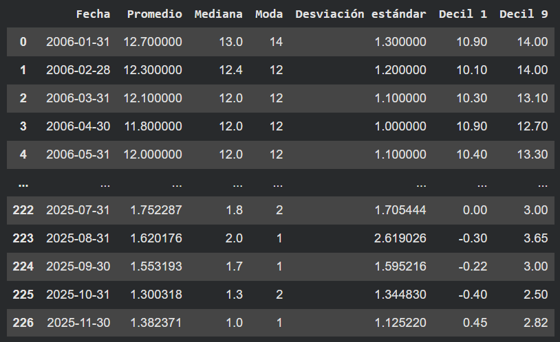

# Descarga datos económicos de Costa Rica 📊
### Librería Open Source que facilita la descarga y manejo de datos económicos públicados en la página del Banco Central De Costa Rica

🚨 Este es un proyecto personal para facilitar tareas de manejo de datos, no está afiliada al BCCR por lo que es sensible a cambios y mejoras que realicen en el sitio web. Cualquier sugerencia o pull request será muy bienvenida y ayudará a mejorar la herramienta.

---

# ¿Qué hace?
Entrar al sitio web del BCCR, descargar el Excel de los datos, subirlos a Python y manejarlos puede ser un proceso un poco repetitivo, en lo personal tener esta herramienta me pemite con un par de líneas de código tener indicadores económicos del BCCR en un dataframe de pandas en segundos

# ¿Cómo la uso?
Es muy sencillo, simplemente se debe escribir las siguientes líneas de código en un entorno .py o .ipynb

```python
import bccr_fetcher

conn = bccr_fetcher.BCCR(
    indicator="IMAE",
    start="",
    end="",
    rows_to_skip=4
)

df = conn.download()
print(df)
```

`conn` es el conector con el sitio del BCCR  y la instancia de la clase, pide ciertos párametros:
- `indicator`: Hay varios. Tales como: `EMPLEO`, `TIPO_DE_CAMBIO`, `TPM`. De momento me encuentro trabajando en añadir más y esperando poder tener soporte para todos los indicadores económicos disponibles en el sitio web
- `start`: (Opcional) este permite ponerle un mínimo de fecha a los datos para obtener el dataframe filtrado por fechas, *importante*: Las fechas deben estar en formáto: AAAA-MM-DD, en caso no indicar una, se descargarán los datos con la fecha que se selecciona por defecto, la cual tiende a ser la más vieja registrada
- `end`: (Opcional) este permite ponerle un máximo de fecha a los datos para obtener el dataframe filtrado por fechas, *importante*: Las fechas deben estar en formáto: AAAA-MM-DD, en caso no indicar una, se descargarán los datos con la fecha que se selecciona por defecto, la cual tiende a ser la más reciente registrada
- `rows_to_skip`: **(IMPORTANTE)** Los Excels brindados por el BCCR (que son los que la librería descargará); inician con un número x de filas con información no númerica, se recomienda usar el parámetro 'rows_to_skip' en la instancia de clase BCCR e indicar rows_to_skip=4, así el dataframe ignorará las primeras 4 filas, esto puede variar, algúnos indicadores económicos traen menos filas sin datos númericos, otros más, por defecto este parámetro será `0`, en caso de no indicarlo más adelante igualmente con ayuda de `pandas` podrá eliminar las filas que no desea.
- `is_colab`: En entornos como los de Google Colab, la función síncrona de `Playwright` no es soportada, ya que estos entornos son asíncronos por defecto, por lo que si se trabaja en un entorno de notebook como Google Colab, este parámetro debe indicarse `True`, porque caso contrario dará error de soporte en la librería `Playwright`, en entornos de Python normales (.py) no hay problema si se coloca en `False`, pero dejándolo en su valor por defecto, el cual es `False`, no habrá ningún problema
- `df` es la variable que contiene lo que el método `download()` devuelve, que es un dataframe con los datos listo para usarse

Actualmente continúo trabajando en la librería, pronto la subiré a `pip` para poder ser descargada de la manera más breve y sencilla posible desde cualquier entorno de Python. Esta librería necesita Python >= 3.10 y las siguientes librerías:
`pandas`  
`playwright`    

Se pueden instalar ejecutando el siguiente cómando en su consola:
`pip install pandas playwright`
Si está por usar la librería desde un entorno de notebook como el de Google Colab:
`!pip install pandas playwright`

Véase un ejemplo de su uso:

```python
import bccr_fetcher

conn = bccr_fetcher.BCCR(
    indicator="EXPECTATIVAS_INFLACION",
    start="",
    end="",
    rows_to_skip=4,
    is_colab=True
)

df = conn.download()
print(df)
```

Salida:  


Como mencioné, esta librería no está afiliada al BCCR, es un proyecto personal y de código abierto, si encuentra un fallo por favor contácteme para solucionarlo lo más breve posible:  
  
Email: josuearias.crc@gmail.com  
Linkedin: https://www.linkedin.com/in/josu%C3%A9-arias-gauna-835bb1342/

